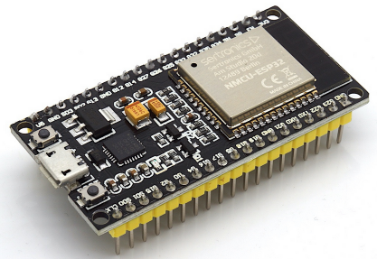
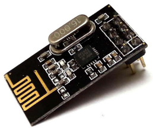
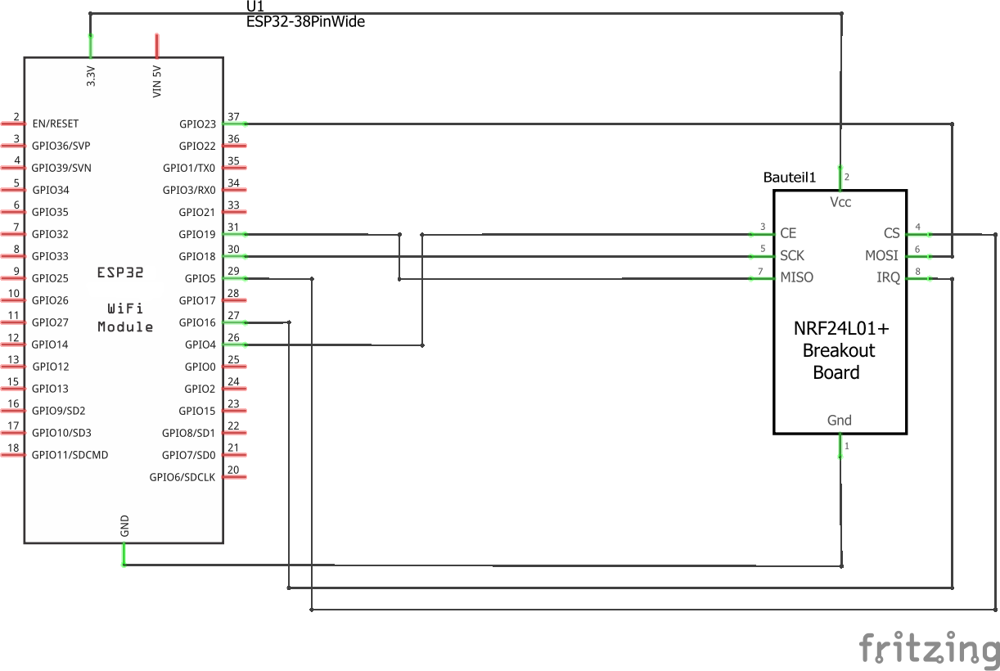
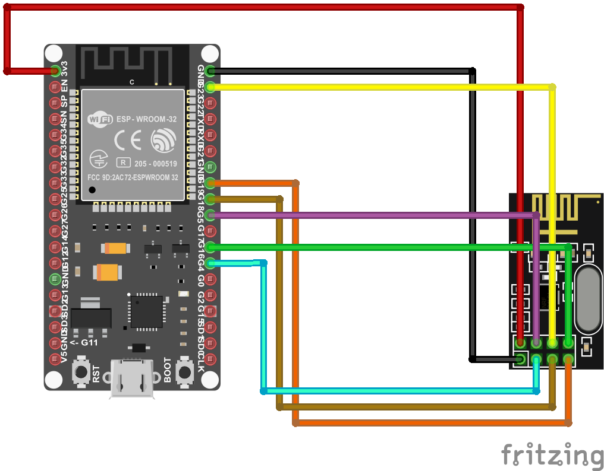
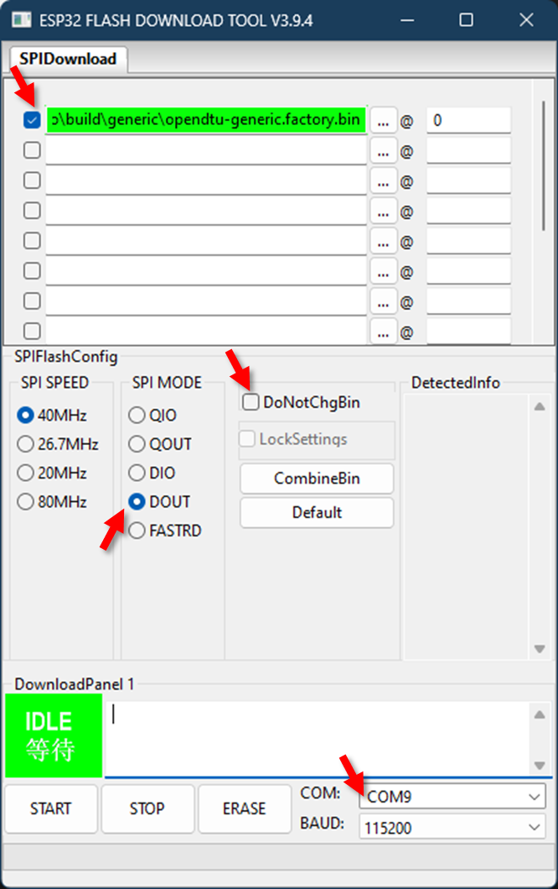

# LoraDTU

<<<<<<< HEAD
A control unit for an inverter connected to a battery, charged by a balcony solar station.
=======
####################################################################################  
This readme file is not yet adapted to LoraDTU !!!
(At the moment it is just a placeholder)
####################################################################################
>>>>>>> d699ddde013d92e3fa08abfc16e59c4036ea6b06

## Background

LoraDTU is based on [OpenDTU](https://github.com/tbnobody/OpenDTU). The aim of the redevelopment was to control the inverter output depending on the current power demand in order to optimise the use of the battery integrated in the system. All adjustments were only made for a special system with a Hoymiles HM-800 and a 24 V LiFePO4 battery.

The current power requirement is read from a smart meter and transmitted to the DTU via LoRa. (The corresponding projects can be found on Github under Ausleser-fuer-Stromzaehler-Smartmeter-Landis-Gyr-E450 and Ausleser-fuer-Stromzaehler-Smartmeter-Ensor-eRS801.)

In contrast to OpenDTU, the project LoraDTU is not actively maintained and updated - it is more a proof of concept.
(Nevertheless, any bug reports, suggestions for improvement and other comments on LoraDTU are welcome, please contact the autor C-E via k-l-p@gmx.de.)

LoraDTU is available free of charge under the open source licence (GNU General Public License version 2). Any warranty beyond that for fraudulently concealed defects is excluded. Any liability for errors, damage and consequential damage is excluded, with the exception of wilful intent and gross negligence. Use at your own risk.


## Screenshots

Several screenshots of the frontend can be found here: [Screenshots](docs/screenshots/README.md)


## Currently supported Inverters

| Model                | Required RF Module | DC Inputs | MPP-Tracker | AC Phases |
| ---------------------| ------------------ | --------- | ----------- | --------- |
| Hoymiles HM-800      | NRF24L01+          | 2         | 2           | 1         |


## Features for end users

* Read live data from inverter
* Show inverters internal event log
* Show inverter information like firmware version, firmware build date, hardware revision and hardware version
* Show and set the current inverter limit
* Function to turn the inverter off and on
* Uses ESP32 microcontroller and NRF24L01+
* Nice and fancy WebApp with visualization of current data
* Firmware upgrade using the web UI
* Time zone support
* Ethernet support
* English, german and french web interface
* Displays (SSD1306, SH1106, PCD8544)
* Status LEDs
* Configuration management (export / import configurations)
* Dark Theme

## Features for developers

* The microcontroller part
  * Build with Arduino PlatformIO Framework for the ESP32
  * Uses a fork of [ESPAsyncWebserver](https://github.com/yubox-node-org/ESPAsyncWebServer) 

* The WebApp part
  * Build with [Vue.js](https://vuejs.org)
  * Source is written in TypeScript


## Hardware you need

### ESP32 board


Sample Picture:




### NRF24L01+ radio board

The PLUS sign is IMPORTANT! There are different variants available, with antenna on the printed circuit board or external antenna.

Sample picture:



Buy your hardware from a trusted source, at best from a dealer/online shop in your country where you have support and the right to return non-functional hardware.
When you want to buy from Amazon, AliExpress, eBay etc., take note that there is a lot of low-quality or fake hardware offered. Read customer comments and ratings carefully!

A heavily incomplete list of trusted hardware shops in germany is:

* [AZ-Delivery](https://www.az-delivery.de/)
* [Makershop](https://www.makershop.de/)
* [Berrybase](https://www.berrybase.de/)

This list is for your convenience only, the project is not related to any of these shops.


### Power supply

Use a power suppy with 5 V and 1 A. The USB cable connected to your PC/Notebook may be powerful enough or may be not.

## Wiring up the NRF24L01+ module

### Schematic



### Symbolic view



### Change pin assignment

Its possible to change all the pins of the NRF24L01+ module, the Display, the LED etc.
The recommend way to change the pin assignment is by creating a custom [device profile](docs/DeviceProfiles.md).
It is also possible to create a custom environment and compile the source yourself. This can be achieved by copying one of the [env:....] sections from 'platformio.ini' to 'platformio_override.ini' and editing the 'platformio_override.ini' file and add/change one or more of the following lines to the 'build_flags' parameter:

```makefile
-DHOYMILES_PIN_MISO=19
-DHOYMILES_PIN_MOSI=23
-DHOYMILES_PIN_SCLK=18
-DHOYMILES_PIN_IRQ=16
-DHOYMILES_PIN_CE=4
-DHOYMILES_PIN_CS=5
```

It is recommended to make all changes only in the  'platformio_override.ini', this is your personal copy.

## Flashing and starting up

### with Visual Studio Code

* Install [Visual Studio Code](https://code.visualstudio.com/download) (from now named "vscode")
* In Visual Studio Code, install the [PlatformIO Extension](https://marketplace.visualstudio.com/items?itemName=platformio.platformio-ide)
* Install git and enable git in vscode - [git download](https://git-scm.com/downloads/) - [Instructions](https://www.jcchouinard.com/install-git-in-vscode/)
* Clone this repository (you really have to clone it, don't just download the ZIP file. During the build process the git hash gets embedded into the firmware. If you download the ZIP file a build error will occur): Inside vscode open the command palette by pressing `CTRL` + `SHIFT` + `P`. Enter `git clone`, add the repository-URL `https://github.com/tbnobody/OpenDTU`. Next you have to choose (or create) a target directory.
* In vscode, choose File --> Open Folder and select the previously downloaded source code. (You have to select the folder which contains the "platformio.ini" and "platformio_override.ini" file)
* Adjust the COM port in the file "platformio_override.ini" for your USB-to-serial-converter. It occurs twice:
  * upload_port
  * monitor_port
* Select the arrow button in the blue bottom status bar (PlatformIO: Upload) to compile and upload the firmware. During the compilation, all required libraries are downloaded automatically.
* Under Linux, if the upload fails with error messages "Could not open /dev/ttyUSB0, the port doesn't exist", you can check via ```ls -la /dev/tty*``` to which group your port belongs to, and then add your user this group via ```sudo adduser <yourusername> dialout``` (if you are using ```arch-linux``` use: ```sudo gpasswd -a <yourusername> uucp```, this method requires a logout/login of the affected user).
* There are two videos showing these steps:
  * [Git Clone and compilation](https://youtu.be/9cA_esv3zeA)
  * [Full installation and compilation](https://youtu.be/xs6TqHn7QWM)

### on the commandline with PlatformIO Core

* Install [PlatformIO Core](https://platformio.org/install/cli)
* Clone this repository (you really have to clone it, don't just download the ZIP file. During the build process the git hash gets embedded into the firmware. If you download the ZIP file a build error will occur)
* Adjust the COM port in the file "platformio_override.ini". It occurs twice:
  * upload_port
  * monitor_port
* build: `platformio run -e generic`
* upload to esp module: `platformio run -e generic -t upload`
* other options:
  * clean the sources:  `platformio run -e generic -t clean`
  * erase flash: `platformio run -e generic -t erase`


#### Flash with esptool.py (Linux)

```bash
esptool.py --port /dev/ttyUSB0 --chip esp32 --before default_reset --after hard_reset \
  write_flash --flash_mode dout --flash_freq 40m --flash_size detect \
  0x0 firmware.factory.bin
```

#### Flash with Espressif Flash Download Tool (Windows)

[Download link](https://www.espressif.com/en/support/download/other-tools)

* On startup, select Chip Type -> "ESP32" / WorkMode -> "Develop"
* Prepare all settings (see picture). Make sure to uncheck the `DoNotChgBin` option. Otherwise you may get errors like "invalid header".
* 
* Press "Erase" button on screen. Look into the terminal window, you should see dots appear. Then press  the "Boot" button on the ESP32 board. Wait for "FINISH" to see if flashing/erasing is done.
* To program, press "Start" on screen, then the "Boot" button.
* When flashing is complete (FINISH appears) then press the Reset button on the ESP32 board (or powercycle ) to start the LoraDTU application.

#### Flash with ESP_Flasher (Windows)

Users report that [ESP_Flasher](https://github.com/Jason2866/ESP_Flasher/releases/) is suitable for flashing LoraDTU on Windows.

#### Flash with [ESP_Flasher](https://espressif.github.io/esptool-js/) - web version

It is also possible to flash it via the web tools which might be more convenient and is platform independent.

## First configuration

* After the initial flashing of the microcontroller, an Access Point called "LoraDTU-*" is opened. The default password is "loradtu".
* Use a web browser to open the address [http://192.168.4.1](http://192.168.4.1)
* Navigate to Settings --> Network Settings and enter your WiFi credentials. The username to access the config menu is "admin" and the password the same as for accessing the Access Point (default: "loradtu").
* LoraDTU then simultaneously connects to your WiFi AP with these credentials. Navigate to Info --> Network and look into section "Network Interface (Station)" for the IP address received via DHCP.
* If your WiFi AP uses an allow-list for MAC-addresses, please be aware that the ESP32 has two different MAC addresses for its AP and client modes, they are also listed at Info --> Network.
* When LoraDTU is connected to a configured WiFI AP, the "LoraDTU-*" Access Point is closed after 3 minutes.
* LoraDTU needs access to a working NTP server to get the current date & time. Both are sent to the inverter with each request. Default NTP server is pool.ntp.org. If your network has different requirements please change accordingly (Settings --> NTP Settings).
* Add your inverter in the inverter settings (Settings --> Inverter Settings)

## Flashing an Update using "Over The Air" OTA Update

Once you have your LoraDTU running and connected to WLAN, you can do further updates through the web interface.
Navigate to Settings --> Firmware upgrade and press the browse button. Select the firmware file from your local computer.

You'll find the firmware file (after a successful build process) under `.pio/build/ttgo-lora32-v21/firmware.bin`.

After the successful upload, the LoraDTU immediately restarts into the new firmware.


## Web API Documentation

A documentation of the Web API can be found here: [Web-API Documentation](docs/Web-API.md)


## Building

* Building the WebApp
  * The WebApp can be build using yarn

    ```bash
    cd webapp
    yarn install
    yarn build
    ```

  * The updated output is placed in the 'webapp_dist' directory
  * It is only necessary to build the webapp when you made changes to it
* Building the microcontroller firmware
  * Visual Studio Code with the PlatformIO Extension is required for building

## Troubleshooting

* First: When there is no light on the solar panels, the inverter completely turns off and does not answer to LoraDTU! So if you assembled your LoraDTU in the evening, wait until tomorrow.
* When there is no data received from the inverter(s) - try to reduce the distance between the LoraDTU and the inverter (e.g. move it to the window towards the roof)
* Under Settings -> DTU Settings you can increase the transmit power "PA level". Default is "minimum".
* The NRF24L01+ needs relatively much current. With bad power supply (and especially bad cables!) a 10 µF capacitor soldered directly to the NRF24L01+ board connector brings more stability (pin 1+2 are the power supply). Note the polarity of the capacitor…
* You can try to use an USB power supply with 1 A or more instead of connecting the ESP32 to the computer.
* Try a different USB cable. Once again, a stable power source is important. Some USB cables are made of much plastic and very little copper inside.
* Double check that you have a radio module NRF24L01+ with a plus sign at the end. NRF24L01 module without the plus are not compatible with this project.
* There is no possibility of auto-discovering the inverters. Double check you have entered the serial numbers of the inverters correctly.
* LoraDTU needs access to a working NTP server to get the current date & time.
* When flashing with VSCode Plattform.IO fails and also with ESPRESSIF tool a demo bin file cannot be flashed to the ESP32 with error message "A fatal error occurred: MD5 of file does not match data in flash!" than un-wire/unconnect ESP32 from the NRF24L01+ board. Try to flash again and rewire afterwards.
* Make sure to connect one inverter only to one DTU (Original, Ahoy, OpenDTU, LoraDTU doesn't make a difference). If you query a inverter by multiple DTUs you will get strange peaks in your values.

## Related Projects

* [OpenDTU](https://github.com/tbnobody/OpenDTU)
* [Ahoy](https://github.com/grindylow/ahoy)
* [DTU Simulator](https://github.com/Ziyatoe/DTUsimMI1x00-Hoymiles)
* [OpenDTU extended to talk to Victrons MPPT battery chargers (Ve.Direct)](https://github.com/helgeerbe/OpenDTU_VeDirect)
