# LoraDTU Screenshots

Here are some screenshots of LoraDTU's web interface.

***
Live View:  

***
Limit Settings:  

***
Power Settings:  

***
Inverter Info:  

***
Eventlog:  

***
Network Admin:  
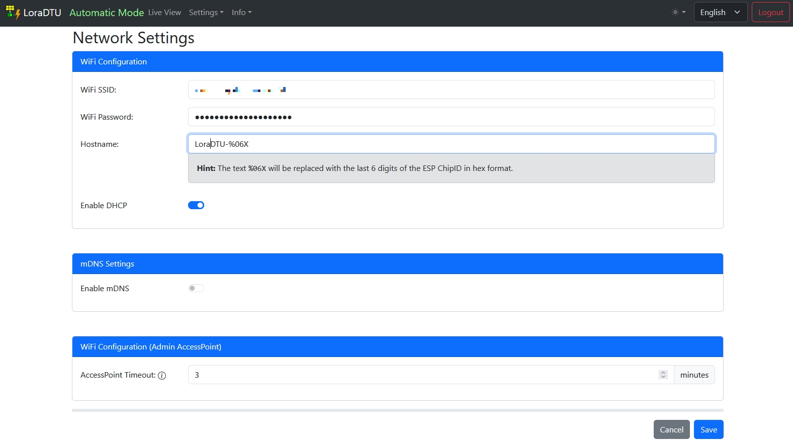

***
NTP Admin:  
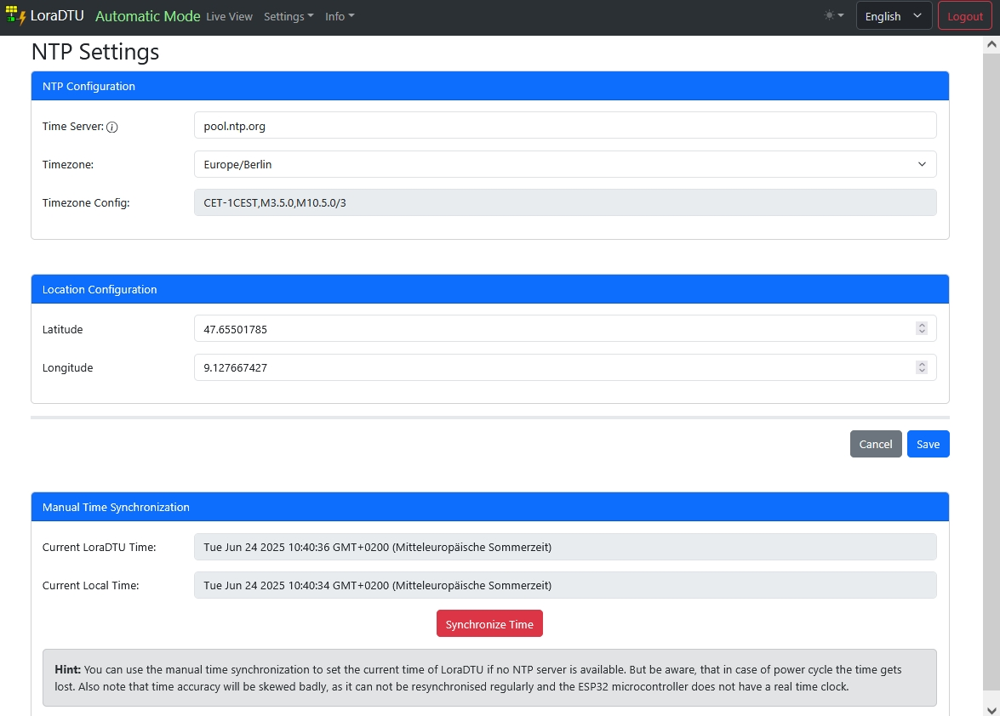

***
Inverter Admin:  
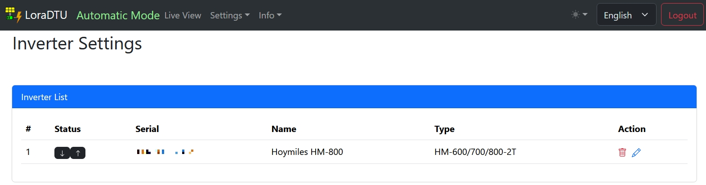

***
Security:  
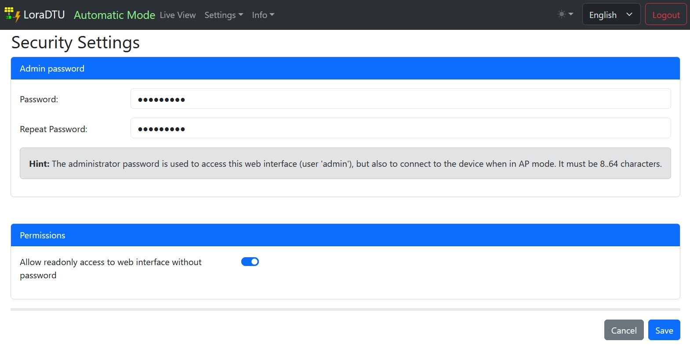

***
DTU Admin:  
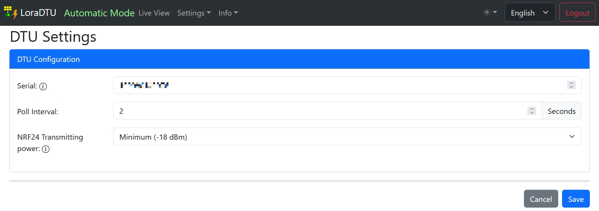

***
Device Manager Connection settings:  
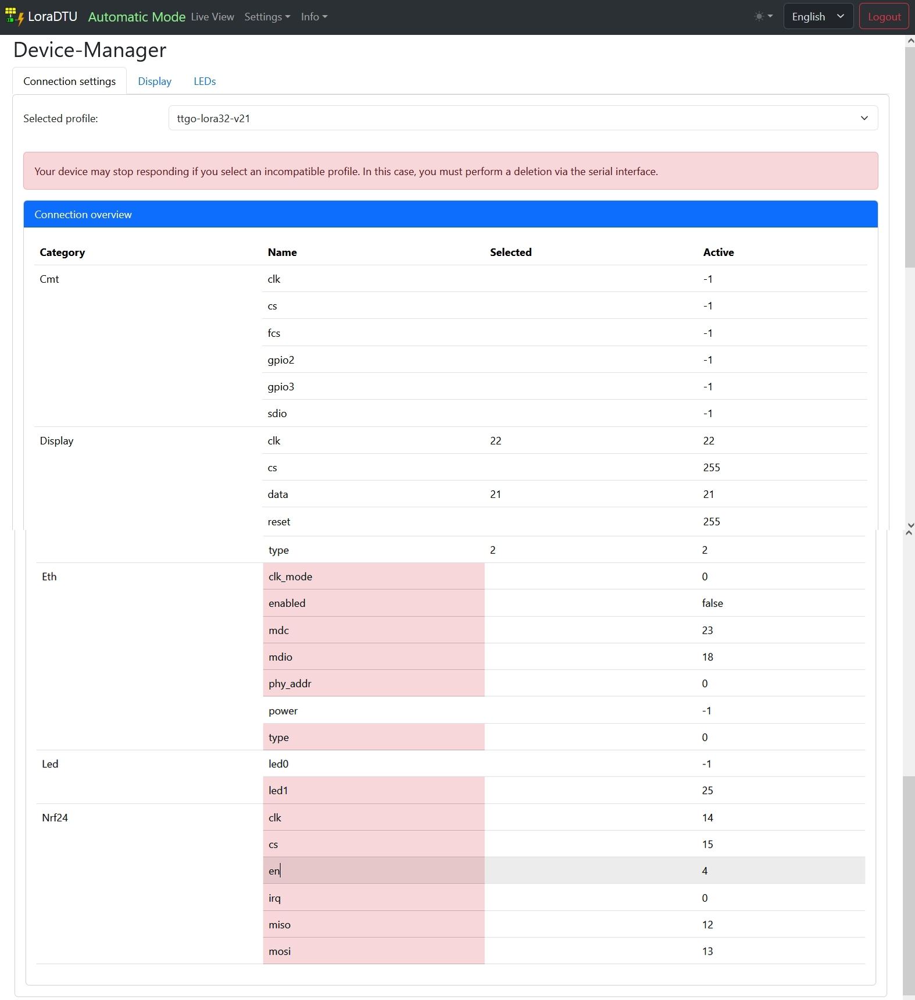

***
Device Manager Display:  
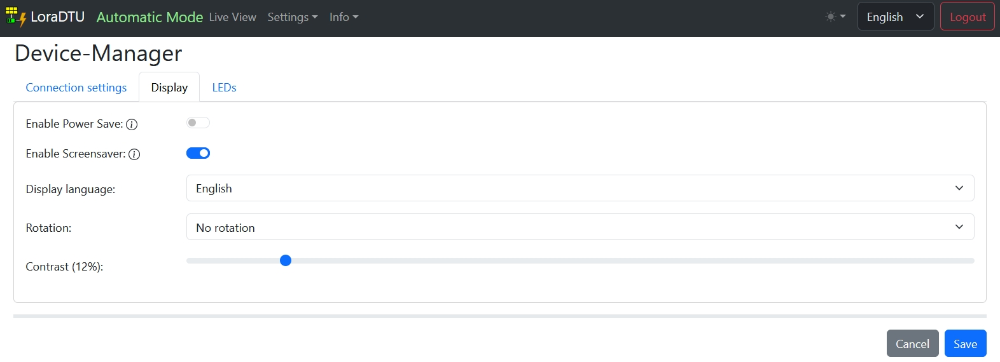

***
Device Manager LED:  
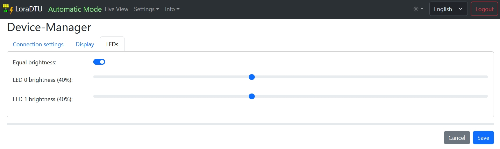

***
Config Management:  
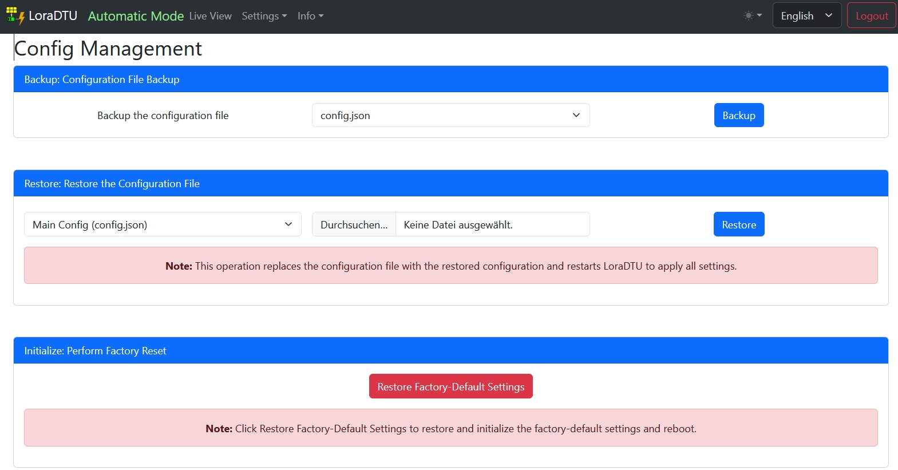

***
Firmware Upgrade:  
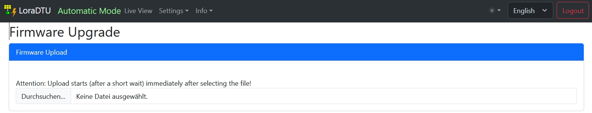

***
Reboot:  
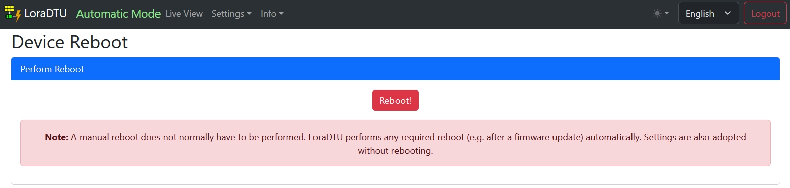

***
System Info:  
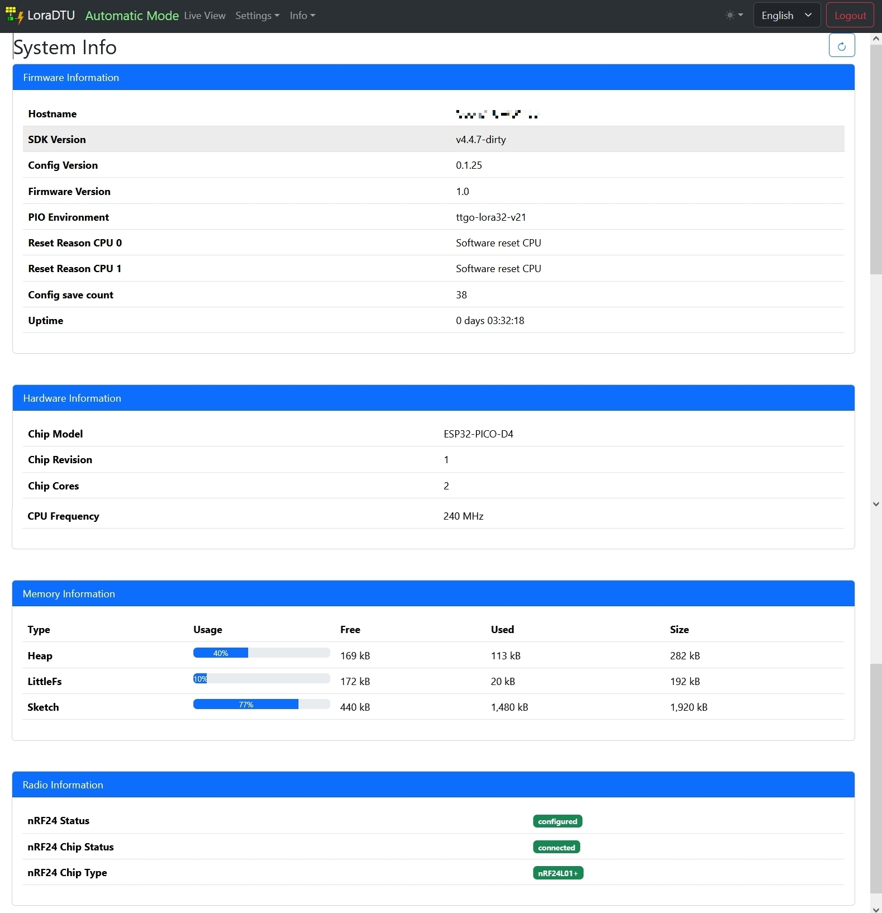

***
Network Info:  
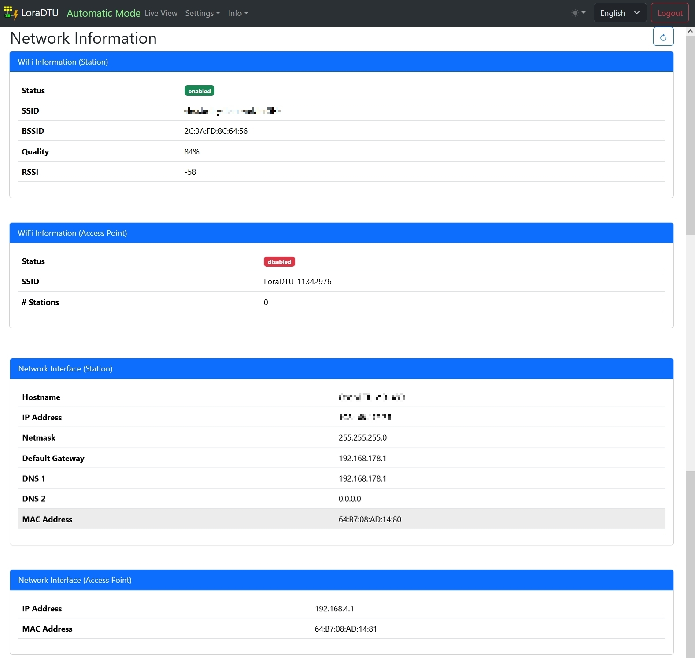

***
NTP Info:  
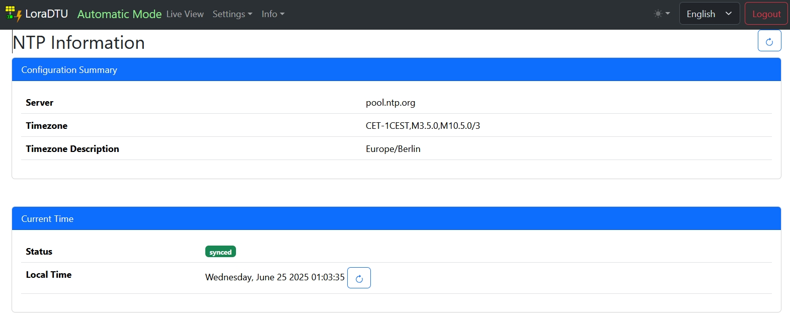

***
Console:  
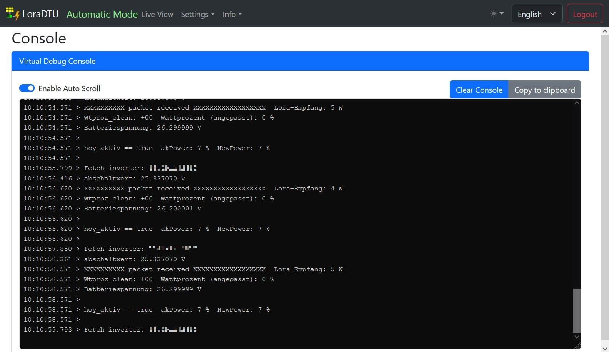

***
About:  
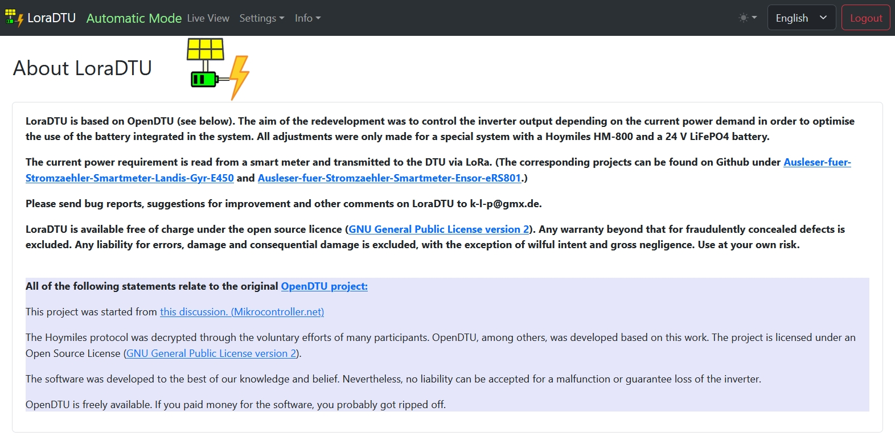
