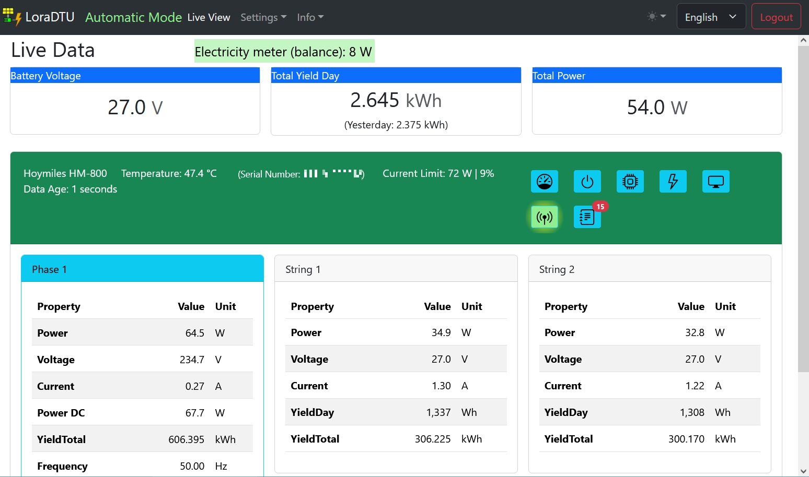

# LoraDTU Screenshots

here are some screenshots of LoraDTU's web interface.

***
Live View:  

***
Limit Settings:  

***
Power Settings:  

***
Inverter Info:  

***
Eventlog:  

***
Network Admin:  

***
NTP Admin:  

***
Inverter Admin:  

***
Inverter Settings:  

***
Security:  

***
DTU Admin:  

***
Device Manager Connection settings:  

***
Device Manager Display:  

***
Config Management:  

***
Firmware Upgrade:  

***
Reboot:  

***
System Info:  

***
Network Info:  

***
NTP Info:  

***
Console:  

